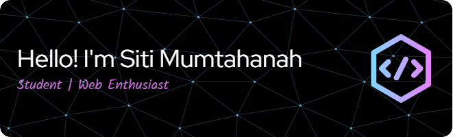

# 💫 About Me:
- 🏫 I'm pursuing my degree in Informatics Engineering at Politeknik Gorontalo.
- 🌱 I’m currently learning Laravel Framework and Cloud Computing on Google Cloud Platform (GCP).
- ⚡ Fun fact: I like watching Chinese dramas and reading novels.

---

## 🌐 Socials:
   

---

## 💻 Tech Stack:
                          

---

## 📊 GitHub Stats:
 
 

---

## 🏆 GitHub Trophies

---

## 🔝 Top Contributed Repo

---

## 🎮Play games with me

###

<picture>
  <source media="(prefers-color-scheme: dark)" srcset="https://raw.githubusercontent.com/HanahIsmail/HanahIsmail/output/pacman-contribution-graph-dark.svg">
  <source media="(prefers-color-scheme: light)" srcset="https://raw.githubusercontent.com/HanahIsmail/HanahIsmail/output/pacman-contribution-graph.svg">
  
</picture>

###

###

###